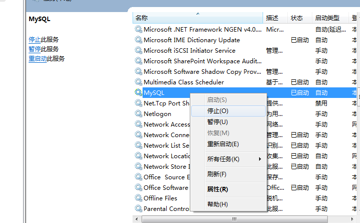
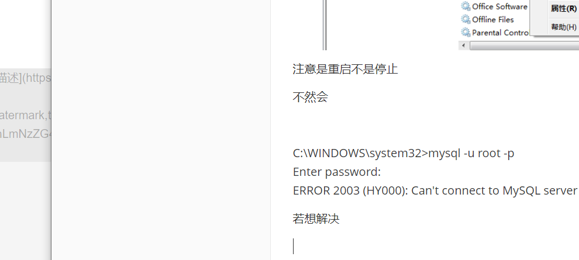

下载mysql

设置my.ini文件

并将C:\mysql-8.0.18-winx64\bin放入系统环境变量

安装mysqld作为window服务并自启

接着

执行安装命令mysqld --initialize --console 

--initialize //创建数据文件目录和mysql系统数据库 产生随机root密码

--console //写错误日志到console window平台

启动服务

可以看到开始是不知道密码的，并且报错

mysql ERROR 1045 (28000): Access denied for user 'ODBC'@'localhost' (using password: ？)

解决方式

在my.ini中添加skip-grant-tables

并在service.msc中将mysql终止然后重启

注意是重启不是停止

不然会

C:\WINDOWS\system32>mysql -u root -p
Enter password:
ERROR 2003 (HY000): Can't connect to MySQL server on 'localhost' (10061)

若想解决

