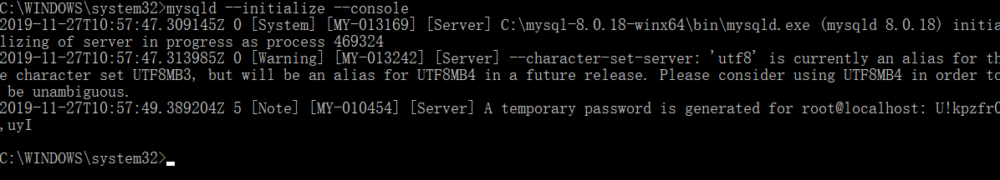
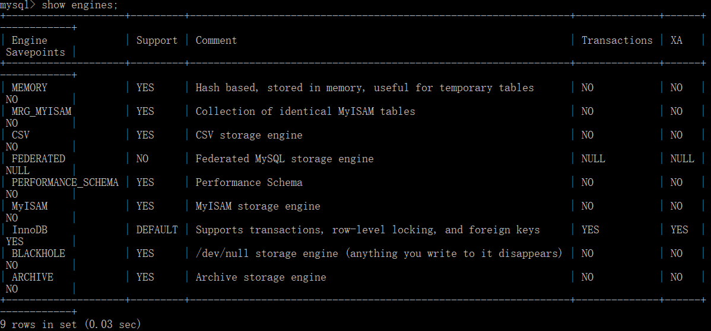
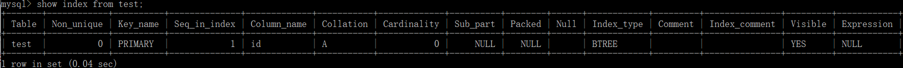
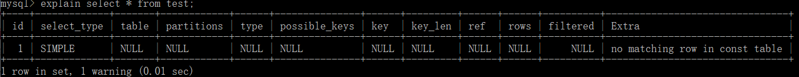
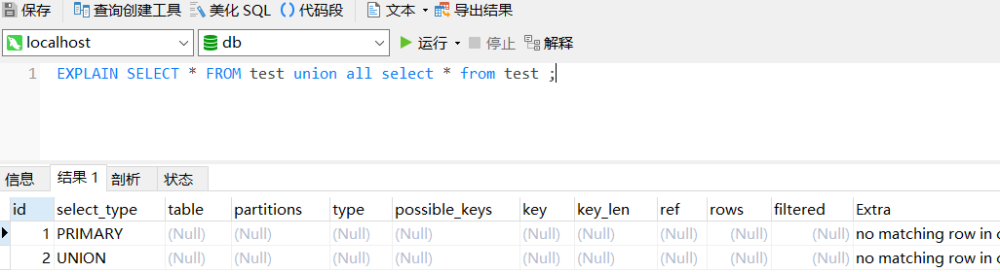
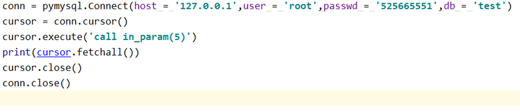

# 安装及遇到问题

下载mysql


在mysql安装目录下设置my.ini文件

```
[mysql]

# 设置mysql客户端默认字符集

default-character-set=utf8
[mysqld]

# 设置3306端口

port = 3306

# 设置mysql的安装目录

basedir= C:\mysql-8.0.18-winx64

# 设置mysql数据库的数据的存放目录

datadir= C:\mysql-8.0.18-winx64\data

# 允许最大连接数

max_connections=20

# 服务端使用的字符集默认为8比特编码的latin1字符集

character-set-server=utf8

# 创建新表时将使用的默认存储引擎

default-storage-engine=INNODB
```

并将C:\mysql-8.0.18-winx64\bin放入系统环境变量

安装mysqld作为window服务并自启


接着

执行安装命令mysqld --initialize --console 

--initialize //创建数据文件目录和mysql系统数据库 产生随机root密码

--console //写错误日志到console window平台



启动服务


可以看到开始是不知道密码的，并且报错

## mysql ERROR 1045 (28000): Access denied for user 'ODBC'@'localhost' (using password: ？)

解决方式

```shell
C:\mysql-8.0.18-winx64\bin>mysqld --initialize-insecure
```

设置不用密码

但是我试了如下办法


在my.ini中添加skip-grant-tables

并在service.msc中将mysql终止然后重启


注意是重启不是停止

不然会

## ERROR 2003 (HY000): Can't connect to MySQL server on 'localhost' (10061)

```shell
C:\WINDOWS\system32>mysql -u root -p
Enter password:
ERROR 2003 (HY000): Can't connect to MySQL server on 'localhost' (10061)
```

如果碰到该错误，可以尝试

```shell
C:\WINDOWS\system32>mysqld -install
The service already exists!
The current server installed: C:\mysql-8.0.18-winx64\bin\mysqld MySQL
```

先查看服务是否存在

并再次启动mysql服务

## MySQL 服务无法启动。服务没有报告任何错误

```shell
C:\WINDOWS\system32>net start mysql
MySQL 服务正在启动 .
MySQL 服务无法启动。

服务没有报告任何错误。

请键入 NET HELPMSG 3534 以获得更多的帮助。
```

解决方式

```shell
C:\mysql-8.0.18-winx64\bin>sc delete mysql
[SC] DeleteService 成功

C:\mysql-8.0.18-winx64\bin>mysqld -install mysql
Service successfully installed.

C:\mysql-8.0.18-winx64\bin>net start mysql
mysql 服务正在启动 .
mysql 服务已经启动成功。
```

启动后 再确保mysql的服务是启动的


或者 查看console

```shell
C:\mysql-8.0.18-winx64\bin>mysqld --console
2019-11-27T15:47:41.655365Z 0 [System] [MY-010116] [Server] C:\mysql-8.0.18-winx64\bin\mysqld.exe (mysqld 8.0.18) starting as process 573180
2019-11-27T15:47:41.666861Z 0 [Warning] [MY-013242] [Server] --character-set-server: 'utf8' is currently an alias for the character set UTF8MB3, but will be an alias for UTF8MB4 in a future release. Please consider using UTF8MB4 in order to be unambiguous.
2019-11-27T15:47:43.130483Z 0 [Warning] [MY-010068] [Server] CA certificate ca.pem is self signed.
2019-11-27T15:47:43.159678Z 0 [System] [MY-010931] [Server] C:\mysql-8.0.18-winx64\bin\mysqld.exe: ready for connections. Version: '8.0.18'  socket: ''  port: 0  MySQL Community Server - GPL.
2019-11-27T15:47:43.164052Z 0 [ERROR] [MY-010131] [Server] TCP/IP, --shared-memory, or --named-pipe should be configured on NT OS
2019-11-27T15:47:43.166252Z 0 [ERROR] [MY-010119] [Server] Aborting
2019-11-27T15:47:43.258632Z 0 [Warning] [MY-011311] [Server] Plugin mysqlx reported: 'All I/O interfaces are disabled, X Protocol won't be accessible'
2019-11-27T15:47:44.060009Z 0 [System] [MY-010910] [Server] C:\mysql-8.0.18-winx64\bin\mysqld.exe: Shutdown complete (mysqld 8.0.18)  MySQL Community Server - GPL.
```

## [ERROR] [MY-010131] [Server] TCP/IP, --shared-memory, or --named-pipe should be configured on NT OS

最终解决方式


添加shared-memory

原因 mysql开发者没有顾及windows用户的感受

```
One more observation: when using --skip-grant-tables to start the server on Windows, the server won't even start unless explicitly specifying a pipe ("--socket .. ") or "--shared-memory" on the command line.

I did this:

Downloaded MySQL 8.0.11 .zip archive, unzipped, successfully executed "mysqld --initialize-insecure" and tried to start the server with

>mysqld --skip-grant-tables --port=3320
-- result: the server starts and quits again immediately.

Error log reads:
2018-04-21T17:58:02.389814Z 0 [System] [MY-010931] [Server] C:\Users\jazcy\Downloads\mysql-8.0.11-winx64\mysql-8.0.11-winx64\bin\mysqld.exe: ready for connections. Version: '8.0.11'  socket: ''  port: 0  MySQL Community Server - GPL.
2018-04-21T17:58:02.391174Z 0 [ERROR] [MY-010131] [Server] TCP/IP, --shared-memory, or --named-pipe should be configured on NT OS
2018-04-21T17:58:02.391871Z 0 [ERROR] [MY-010119] [Server] Aborting
2018-04-21T17:58:02.521775Z 0 [Warning] [MY-011311] [Server] Plugin mysqlx reported: 'All I/O interfaces are disabled, X Protocol won't be accessible'
2018-04-21T17:58:03.714223Z 0 [System] [MY-010910] [Server] C:\Users\jazcy\Downloads\mysql-8.0.11-winx64\mysql-8.0.11-winx64\bin\mysqld.exe: Shutdown complete (mysqld 8.0.11)  MySQL Community Server - GPL.

The culprit here obviously is that neither TCP, named pipe nor shared memory is available for communication with clients and this causes the server to shutdown itself (what makes some sense, as it is useless). 

If I specify a non-TCP connect option on the command line like 
mysqld --port=3306 --skip-grant-tables --shared-memory
.. the server starts and I can again connect with the CLI ("mysql -uroot -p --port=3320").

At least if --skip-networking should continue to be implicit with--skip-grant-tables, and if no pipe is specified, then it should be considered that --shared-memory also should be on Windows.  

I will not be surprised if MySQL developers haven't considered consequences for Windows users at all. Actually I will be surprised if they did at all. It will not be the first time.
```

这样无需密码就可以进入mysql

```
C:\mysql-8.0.18-winx64\bin>mysql -u root -p
Enter password:
Welcome to the MySQL monitor.  Commands end with ; or \g.
Your MySQL connection id is 7
Server version: 8.0.18 MySQL Community Server - GPL

Copyright (c) 2000, 2019, Oracle and/or its affiliates. All rights reserved.

Oracle is a registered trademark of Oracle Corporation and/or its
affiliates. Other names may be trademarks of their respective
owners.

Type 'help;' or '\h' for help. Type '\c' to clear the current input statement.

mysql>
```

# 数据库调优

## 原则

•数据库表需最大程度遵守三范式

•字段选择的能占用字节少的字段就不用大字段

•字段的命名要有意义

•数据库可以有适当的冗余，有时可以适当的降低范式标准

•根据应用场合选择表的存储引擎

## MyISAM特点

•主要面向一些OLAP数据库应用；

•数据存储方式简单、少碎片、支持大文件、能够进行索引压缩；

•访问速度飞快，是所有MySQL文件引擎中速度最快的；

•不支持一些数据库特性，比如事务、外键约束等；

•表级锁，性能稍差，更适合读取多的操作（查询和更新操作并行时，查询操作需等待更新操作结束）

## InnoDB特点

•主要面向在线事务处理（OLTP）的应用；

•支持事务、外键约束等数据库特性；

•行级锁，读写性能都非常优秀。（在默认“可重复读”事务隔离级别下，查询和更新操作并行时，查询操作不需要等待）；

•能够承载大数据量的存储和访问；

•拥有自己独立的缓冲池，能够缓存数据和索引

## 代码
### 查看mysql的存储引擎

```shell
mysql> show engines;
+--------------------+---------+----------------------------------------------------------------+--------------+------+------------+

| Engine | Support | Comment | Transactions | XA   | Savepoints |
| ------ | ------- | ------- | ------------ | ---- | ---------- |
|        |         |         |              |      |            |

+--------------------+---------+----------------------------------------------------------------+--------------+------+------------+

| MEMORY             | YES     | Hash based, stored in memory, useful for temporary tables    | NO   | NO   | NO   |
| ------------------ | ------- | ------------------------------------------------------------ | ---- | ---- | ---- |
|                    |         |                                                              |      |      |      |
| MRG_MYISAM         | YES     | Collection of identical MyISAM tables                        | NO   | NO   | NO   |
| ----------         | ----    | -------------------------------------                        | ---- | ---- | ---- |
|                    |         |                                                              |      |      |      |
| CSV                | YES     | CSV storage engine                                           | NO   | NO   | NO   |
| ----               | ----    | ------------------                                           | ---- | ---- | ---- |
|                    |         |                                                              |      |      |      |
| FEDERATED          | NO      | Federated MySQL storage engine                               | NULL | NULL | NULL |
| ---------          | ----    | ------------------------------                               | ---- | ---- | ---- |
|                    |         |                                                              |      |      |      |
| PERFORMANCE_SCHEMA | YES     | Performance Schema                                           | NO   | NO   | NO   |
| ------------------ | ----    | ------------------                                           | ---- | ---- | ---- |
|                    |         |                                                              |      |      |      |
| MyISAM             | YES     | MyISAM storage engine                                        | NO   | NO   | NO   |
| ------             | ----    | ---------------------                                        | ---- | ---- | ---- |
|                    |         |                                                              |      |      |      |
| InnoDB             | DEFAULT | Supports transactions, row-level locking, and foreign keys   | YES  | YES  | YES  |
| ------             | ------- | ----------------------------------------------------------   | ---- | ---- | ---- |
|                    |         |                                                              |      |      |      |
| BLACKHOLE          | YES     | /dev/null storage engine (anything you write to it disappears) | NO   | NO   | NO   |
| ---------          | ----    | ------------------------------------------------------------ | ---- | ---- | ---- |
|                    |         |                                                              |      |      |      |
| ARCHIVE            | YES     | Archive storage engine                                       | NO   | NO   | NO   |
| -------            | ----    | ----------------------                                       | ---- | ---- | ---- |
|                    |         |                                                              |      |      |      |

+--------------------+---------+----------------------------------------------------------------+--------------+------+------------+
9 rows in set (0.03 sec)
```



### 创建及查看表的存储引擎：

要查看一张表的存储引擎 得现有这张表。

```shell
mysql> create table test(
    -> id int not null,
    -> primary key(id)
    -> );
ERROR 1046 (3D000): No database selected
mysql> \l
ERROR:
Unknown command '\l'.
    -> ;
ERROR 1064 (42000): You have an error in your SQL syntax; check the manual that corresponds to your MySQL server version for the right syntax to use near '\l' at line 1
mysql> create database db
    -> ;
Query OK, 1 row affected (0.07 sec)

mysql> use db;
Database changed
mysql> create table test(
    -> id int not null,
    -> primary key(id)
    -> );
Query OK, 0 rows affected (0.09 sec)

mysql> show create table test;
+-------+----------------------------------------------------------------------------------------------------------+
| Table | Create Table                                                                                             |
+-------+----------------------------------------------------------------------------------------------------------+
| test  | CREATE TABLE `test` (
  `id` int(11) NOT NULL,
  PRIMARY KEY (`id`)
) ENGINE=InnoDB DEFAULT CHARSET=utf8 |
+-------+----------------------------------------------------------------------------------------------------------+
1 row in set (0.02 sec)
```

### 修改表的存储引擎

```shell
mysql> alter table test engine=MyISAM;
Query OK, 0 rows affected (0.07 sec)
Records: 0  Duplicates: 0  Warnings: 0
```

## 索引的好处和坏处

•**创建索引的好处**：

  提高查询速度

  **利用索引的唯一性来控制记录的唯一性**

  **可以加速表与表之间的连接**

  **降低查询中分组和排序的时间**

•**创建索引的坏处**：

**是冗余**

  存储索引占用磁盘空间；

  执行数据修改操作产生索引维护

## 索引创建的一般原则

•在了解表的具体应用场景基础上建立索引；

**•为所有主键和外键列建立索引；**

**•在经常用在连接的列上建立索引；**

•在经常需要根据范围进行搜索的列上建立索引；

•**对出现在WHERE子句、ORDER BY或GROUP BY子句中的列考虑建立索引；**

•对需要确保唯一性的列考虑建立索引；

•数据更新频繁的列不宜建立索引；

•对于那些只有很少数据值的列也不应该增加索引

## 代码

### 查看索引

```shell
mysql> show index from test;
+-------+------------+----------+--------------+-------------+-----------+-------------+----------+--------+------+------------+---------+---------------+---------+------------+
| Table | Non_unique | Key_name | Seq_in_index | Column_name | Collation | Cardinality | Sub_part | Packed | Null | Index_type | Comment | Index_comment | Visible | Expression |
+-------+------------+----------+--------------+-------------+-----------+-------------+----------+--------+------+------------+---------+---------------+---------+------------+
| test  |          0 | PRIMARY  |            1 | id          | A         |           0 |     NULL |   NULL |      | BTREE      |         |               | YES     | NULL       |
+-------+------------+----------+--------------+-------------+-----------+-------------+----------+--------+------+------------+---------+---------------+---------+------------+
1 row in set (0.04 sec)
```



### 创建索引

mysql> create index theid on test(id);
Query OK, 0 rows affected (0.06 sec)
Records: 0  Duplicates: 0  Warnings: 0

### 删除索引

mysql> drop index theid on test;
Query OK, 0 rows affected (0.04 sec)
Records: 0  Duplicates: 0  Warnings: 0

### explain输出sql语句详细信息

用法：  explain （select，delete，insert，update）



### Navicat Premium可视化

既可以可视化mysql，对mongodb postgresql也可以

之后使用可视化界面进行操作

### 一些概念

•id：查询序列号，即为sql语句的执行顺序

•select_type:查询类型，常见值包括simple、primary、subquery、derived、union

•table: 这一步访问数据库中表的名称

•type: 对表访问方式，在表中找到所需要行的方式，常用的类型：all、index、range、ref

•possible_keys:能够使用哪个索引在表中找到记录

•key:实际决定使用的索引

•key_len:表示索引中使用的字节数

•ref:显示使用哪些列或常量与key一起从表中选择数据行

•rows:估算出结果集行数，根据表统计信息及索引使用情况，估算的找到所需记录所需要的读取行数

•extra:该列包含查询的详情信息


#### id 序列号

#### 查询类型

simple


union 联合



union result


#### type 对表访问方式

　　type 列代表表示 查询计划的连接类型, 有多个参数，先从最佳类型到最差类型介绍 **重要且困难**

　　**性能： null > system/const > eq_ref > ref > ref_or_null >index_merge > range > index > all** 

   **type=NULL　在优化过程中就已得到结果，不用再访问表或索引。**

 type=const/system 常量

　　在整个查询过程中这个表最多只会有一条匹配的行，比如主键 id=1 就肯定只有一行；

表最多有一个匹配行，const用于比较primary key 或者unique索引。因为只匹配一行数据，所以一定是用到primary key 或者unique 情况下才会是const,看下面这条语句

```
EXPLAIN ``SELECT` `* ``FROM` `person ``where` `id =2;
```


所以说可以理解为const是最优化的。

type=eq_ref **使用有唯一性 索引查找（主键或唯一性索引）**

　对于eq_ref的解释，mysql手册是这样说的:"对于每个来自于前面的表的行组合，从该表中读取一行。这可能是最好的联接类型，除了const类型。它用在一个索引的所有部分被联接使用并且索引是UNIQUE或PRIMARY KEY"。eq_ref可以用于使用=比较带索引的列。看下面的语句　

```
`EXPAIN ``select` `* ``from` `person,dept ``where` `person.id = dept.did;`
```

 得到的结果是下图所示。很明显，mysql使用eq_ref联接来处理 dept 表。　　


### sql性能分析

•获取执行时间：
 show variables like “%pro%”;

•开启show profiles功能：

 set profiling = 1;

•查看每条执行过的SQL语句的执行时间：

  show profiles;

•查看详细执行时间：

  show profile for query “7”;

•查看cpu、io、swaps、context switches等信息:

  show profile block io,cpu for query “7”;

### Mysql配置参数

#### 调整线程缓存的大小

per_thread_buffers = (read_buffer_size + read_rnd_buffer_size + sort_buffer_size + thread_stack + join_buffer_size + binlog_cache_size) * max_connections

•read_buffer_size ：读入缓冲区大小

•sort_buffer_size ：执行排序使用的缓冲区大小

•read_rnd_buffer_size ：随机读缓冲区大小

•thread_stack ：每个线程的堆栈大小

•join_buffer_size ：join连接操作时，如果关联的字段没有索引，会出现此参数

•tmp_table_size ：临时表的缓冲大小

•binlog_cache_size ：在事务过程中容纳的二进制日志SQL语句的缓存大小

•max_connections ：最大连接数

#### 调整全局缓存的大小

global_buffers = innodb_buffer_pool_size + innodb_additional_mem_pool_size + innodb_log_buffer_size + key_buffer_size + query_cache_size

•innodb_buffer_pool_size : innodb使用该参数指定大小的内存来缓冲数据和索引

•innodb_additional_mem_pool_size : 指定innodb用来存储数据字典和其他内部数据结构的内存池大小

•innodb_log_buffer_size : 指定innodb用来存储日志数据的缓存大小

•key_buffer_size : 决定索引处理的速度

•query_cache_size : 缓存select语句和结果集大小的参数

#### 使用查询缓存

 将select查询的结果缓存在内存中，以供下次直接获取

  查看查询缓存是否启用：

   show variables like’%query_cache%’;

  开启查询缓存：修改配置文件

  query_cache_size = 20M

query_cache_type = 1

#### 定位慢查询和不使用索引的查询

 set global slow_query_log = ‘ON’;

  set global log_queries_not_using_indexes = ‘ON’;

### 存储过程 优化数据库访问性能

•SQL语言是应用程序和数据库之间的主要编程接口

•使用SQL语言编写访问数据库的代码时，可以用两种方式存储和执行这些代码

ü 在客户端存储代码，并创建向数据库服务器发送的SQL命令

ü 将SQL语句存储在数据库服务器端，然后由应用程序调用执行这些SQL语句

•存储在数据库服务器端供客户端调用执行的SQL语句就是存储过程

### 存储过程功能

•接受输入参数并以输出参数的形式将多个值返回给调用者

•包含执行数据库操作的语句

•将查询语句执行结果返回到客户端内存中

### 存储过程优点

•允许模块化程序设计

  只需要创建一次并存储在数据库中，就可以在应用程序中反复调用该存储过程

•改善性能

  在创建存储过程时对代码进行分析和优化，并在第一次执行时进行语法检查和编译，将编译好的可执行代码存储在内存的一个专门缓冲区中，以后再执行存储过程时，只需要直接执行内存中的可执行代码即可

•减少网络流量

  只需要一条执行存储过程的代码即可实现，因此，不再需要在网络中传送大量的代码

### 创建和执行存储过程

•查看所有存储过程：
 show procedure status;


•声明语句结束符：

  delimiter //

•创建：create procedure 存储过程名（参数）

  begin  （需要的业务）  end

•调用：call 存储过程名（参数）

 [参考](https://www.runoob.com/w3cnote/mysql-stored-procedure.html)

### python调用存储过程



# 停止mysql及终止服务

 退出数据库exit 

 停止MySQL服务net stop mysql 